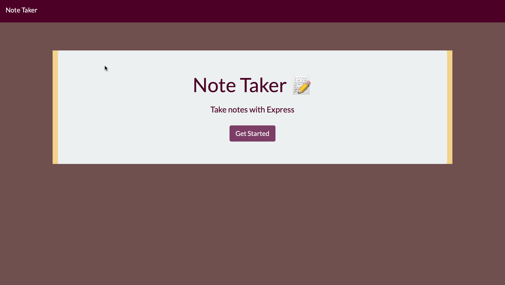
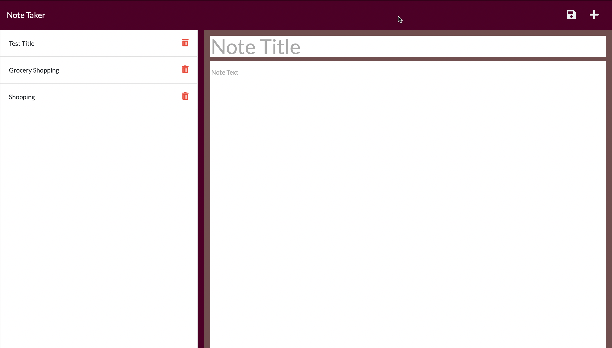

# note-app-routes
Here is the deployed application so you can use it too! : ( https://heroku-note-app-aa.herokuapp.com)

## Description
I created a simple Note taker application that allows a user to organize his thoughts and keep track of tasks that need to be completed. The user will be able to write as many notes wanted and as well save those notes . This app has been deployed to Heroku and anyone can have access to it as well.

- Why did you build this project? 
I built this project to give the user and easy and sufficient way to be able to write notes and save them .It gives easy access, a landing page with a link to a note page, when the note page is clicked you will be presented with a page with existing notes listed in the left-hand column, plus empty fields to enter a new note title and the note’s text in the right-hand column. When you enter a new note title and the note’s text, then a Save icon appears in the navigation at the top of the page, when the Save icon is clicked the new note that was entered is saved and appears in the left-hand column with the other existing notes. The user will have access to click on the existing notes in the list in the left-hand column and be able to view the saved note details.

## Usage

## License

License

---
